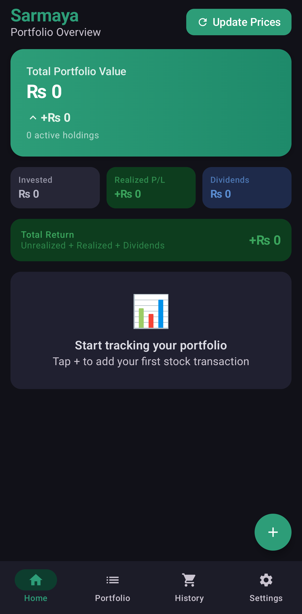
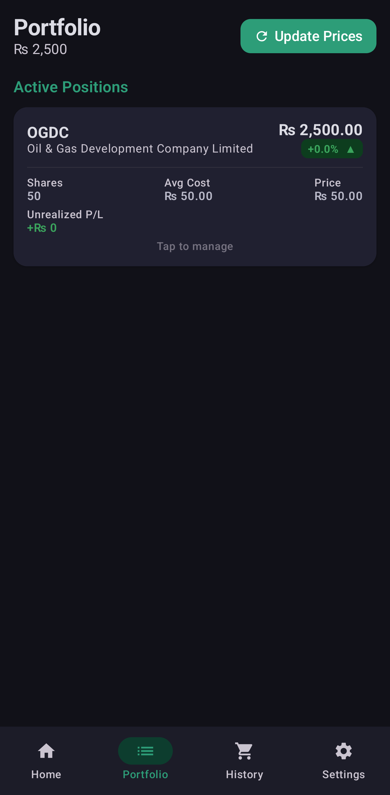
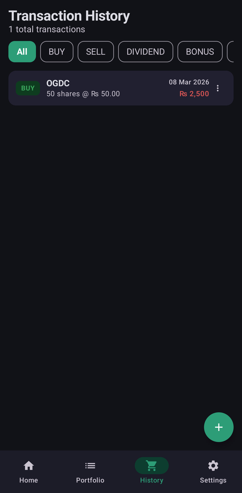

<p align="center">
  
</p>

<h1 align="center">Sarmaya (سرمایہ)</h1>

<p align="center">
  <strong>A modern, offline-first portfolio tracker for the Pakistan Stock Exchange</strong>
</p>

<p align="center">
  <a href="https://github.com/dev-Aatif/sarmaya/releases"></a>
  <a href="LICENSE"></a>
  
  
  
</p>

---

## ✨ Features

- **Event-Sourced Portfolio Engine** — Computes holdings by replaying your full transaction history, guaranteeing mathematical accuracy across BUY, SELL, DIVIDEND, BONUS, and SPLIT transactions.
- **Realized P/L Tracking** — Accurately tracks profit/loss on every sell, separate from unrealized gains. Total return = unrealized + realized + dividends.
- **Dashboard at a Glance** — Gradient portfolio card, quick stats (invested, realized P/L, dividends), top movers, sector allocation, and recent activity.
- **Transaction Management** — Add, edit, and delete transactions with full validation. Filter by type (BUY/SELL/DIVIDEND/BONUS/SPLIT).
- **Price Updates** — Manually update current stock prices to see live P/L across your portfolio.
- **Adversarial Resilience** — Domain validation layer blocks time-travel paradoxes (selling before buying), NaN poisoning, and invalid state mutations.
- **Offline First** — Powered by a local Room database with no internet dependency.
- **Dark Mode** — Full dark/light theme support with a curated emerald color palette.

## 📸 Screenshots

<p align="center">
  
  &nbsp;&nbsp;
  
  &nbsp;&nbsp;
  
</p>

<p align="center">
  <sub>Dashboard &nbsp;•&nbsp; Portfolio Holdings &nbsp;•&nbsp; Transaction History</sub>
</p>

## 🏗 Tech Stack

| Component | Technology |
|-----------|------------|
| Language | Kotlin |
| UI | Jetpack Compose |
| Design System | Material 3 |
| Database | Room (SQLite) |
| Architecture | MVVM + Event Sourcing |
| Async | Kotlin Coroutines & Flow |
| Min SDK | Android 8.0 (API 26) |
| Target SDK | Android 14 (API 34) |

## 📂 Project Structure

```
app/src/main/java/com/sarmaya/app/
├── data/            # Room entities, DAOs, PortfolioCalculator
├── domain/          # TransactionDomainModel (validation layer)
├── viewmodel/       # MVVM ViewModels
├── ui/
│   ├── screens/     # Dashboard, Holdings, Transactions, Settings
│   ├── components/  # Bottom sheets, pickers
│   ├── navigation/  # Tab navigation with Crossfade
│   └── theme/       # Colors, typography, SarmayaFinanceColors

scripts/
└── build_psx_db.py  # Fetches live PSX symbols and builds the pre-seeded stock database
```

## 🚀 Getting Started

### Prerequisites

- Android Studio Koala (2024.1) or later
- JDK 17+

### Build & Run

```bash
# Clone the repository
git clone https://github.com/dev-Aatif/sarmaya.git
cd sarmaya

# Run tests (48+ tests including adversarial scenarios)
./gradlew test

# Build debug APK
./gradlew assembleDebug

# Build release APK
./gradlew assembleRelease
```

The APK will be at `app/build/outputs/apk/debug/app-debug.apk` (or `release/`).

### Refreshing Stock Data

The stock database is pre-seeded from PSX. To refresh it with the latest symbols:

```bash
cd scripts
python3 build_psx_db.py
```

## 🧪 Testing

The project includes **48+ unit tests** covering:

- Core `PortfolioCalculator` logic (BUY, SELL, DIVIDEND, BONUS, SPLIT)
- Realized P/L calculations across multiple sell scenarios
- `totalReturn` combining unrealized + realized + dividends
- Adversarial scenarios (chronological paradoxes, ghost shares, NaN injection)
- ViewModel integration tests

```bash
./gradlew test
```

## 📝 Changelog

### v1.0.0 (2026-03-08)

- 🎉 Initial release
- Event-sourced portfolio calculator with realized P/L tracking
- Dashboard with portfolio summary, top movers, sector allocation
- Holdings screen with unrealized/realized P/L and dividend tracking
- Transaction management with type filtering
- Manual price updates
- Dark/light theme with emerald color palette
- About & credits page
- 48+ unit and adversarial tests

## 🤝 Contributing

Contributions, issues, and feature requests are welcome!

1. **Fork** the repository
2. **Create** your feature branch (`git checkout -b feature/amazing-feature`)
3. **Commit** your changes (`git commit -m 'feat: add amazing feature'`)
4. **Push** to the branch (`git push origin feature/amazing-feature`)
5. **Open** a Pull Request

Feel free to open an [issue](https://github.com/dev-Aatif/sarmaya/issues) if you find a bug or have a suggestion.

## 📄 License

This project is licensed under the MIT License — see the [LICENSE](LICENSE) file for details.

## 👤 Author

**Aatif** — [GitHub](https://github.com/dev-Aatif)
